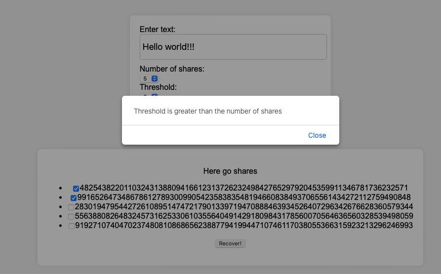

# shamir_rust

The repo takes a Rust implementation of Shamir Secret Sharing over Finite Field and exposes it as WASM library. 
Next it showcases the usage using simple HTML page.

Components:
1. ```src/lib``` - Rust implementation
2. ```tests``` - Rust integration tests
3. ```index.html``` - simple HTML page that demos the usage.


# how to run

1. Clone the repo
2. Prepare your environment according to the description on this page: https://rustwasm.github.io/book/game-of-life/setup.html
3. Build the wasm library: ```wasm-pack build --target web```
4. Optionally:
    1. Run Rust tests: ```cargo test```
    2. Run wasm tests" ```wasm-pack test --node```
5. Run HTTP server: ```python3 -m http.server```
6. Go to ```http://localhost:8000```

## Demo 

1. Open a page (```http://localhost:8000```)


2. Click Submit to generates shares from provided text and with defined threshold


3. Select number of shares below threshold and click Recover



4. Select number of shares equal or greater than threshold and click Recover


# Some interesting challanges/things to consider 

TODO