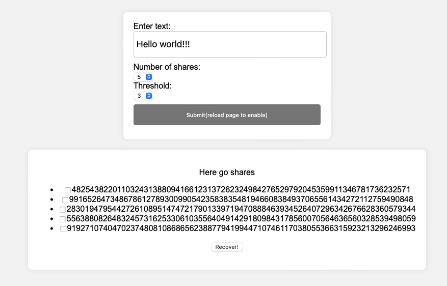
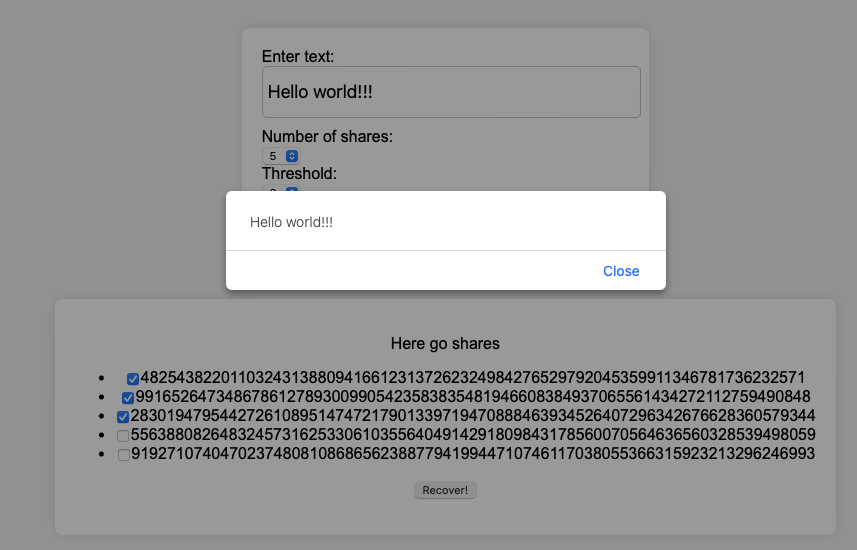

# shamir_rust

The repo takes a Rust implementation of Shamir Secret Sharing over Finite Field and exposes it as WASM library. 
Next it showcases the usage using simple HTML page.

Components:
1. ```src/lib``` - Rust implementation
2. ```tests``` - Rust integration tests
3. ```index.html``` - simple HTML page that demos the usage.


# how to run

1. Clone the repo
2. Prepare your environment according to the description on this page: https://rustwasm.github.io/book/game-of-life/setup.html
3. Build the wasm library: ```wasm-pack build --release --target web```
4. Optionally:
    1. Run Rust tests: ```cargo test```
    2. Run wasm tests" ```wasm-pack test --node```
5. Run HTTP server: ```python3 -m http.server```
6. Go to ```http://localhost:8000```

## Demo 

1. Open a page (```http://localhost:8000```)


2. Click Submit to generates shares from provided text and with defined threshold



3. Select number of shares below threshold and click Recover


4. Select number of shares equal or greater than threshold and click Recover



# Some challenges/things to consider 

## Source of entropy

shamir_secret_sharing package is quite old and its newest version 0.1.1, published to crates.io, supports rand package in version 0.5 which in turn doesn't support wasm-bindgen. As a result, rand doesn't work when compiled to wasm library (the error says that source of entropy is not available).

Support for wasm-bindgen in rand started from version 0.6. Interestingly, the newest code committed to shamir_secret_sharing repo in master branch supports rand 0.6, but it doesn't compile to wasm lib (compilation errors).

The solution was to fork shamir_secret_sharing repo, take the latest working commit (which represents version 0.1.1 published to crates.io) and modify its Cargo.toml to support rand version 0.6. This change has been done in a separate branch.
Finally, we can reference the fixed package in our Cargo.toml and enable support for "wasm-bindgen" in rand.

## Main function in Rust

There is an example that shows how to deploy WASM:
https://rustwasm.github.io/docs/wasm-bindgen/examples/without-a-bundler.html

In this example, there is an error in this line:
```rust
#[wasm_bindgen(start)]
pub fn main() -> Result<(), JsValue> {
```

Turns out this function can't be called ```main``` (any other name can be used). 
Issue is described here in detail:
https://github.com/rustwasm/wasm-bindgen/issues/2206


## Tests in headless browser

Running the tests like this ```wasm-pack test --<browser_name> --headless``` fails with the error:
```http://127.0.0.1:49410/session/fdeaa5a7b92f04d662568146055c3f51/url: status code 404```

It happens not only for the custom code implemented in this repo but also for the code taken from:
https://rustwasm.github.io/book/game-of-life/hello-world.html

The reason is currently unknown. This needs to be investigated.

## WASM size

The build without any custom dependencies (just after starting implementation) had a size below 1 KB. Currently, after importing all dependencies, the size is 99KB. 
There is definitely a space for improvement.

There is a good tutorial on this topic:
https://rustwasm.github.io/book/reference/code-size.html


